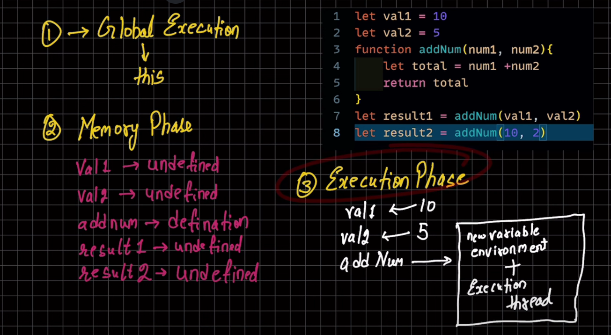
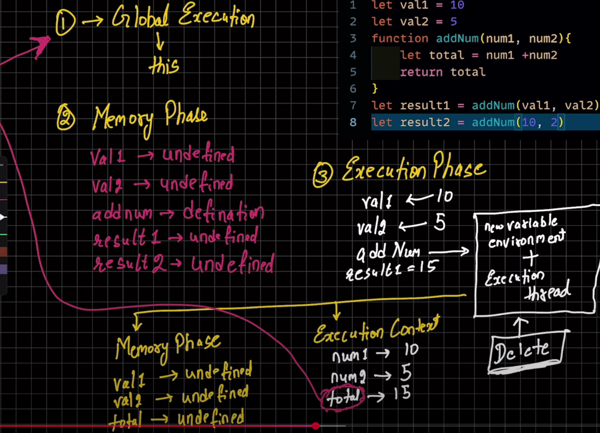
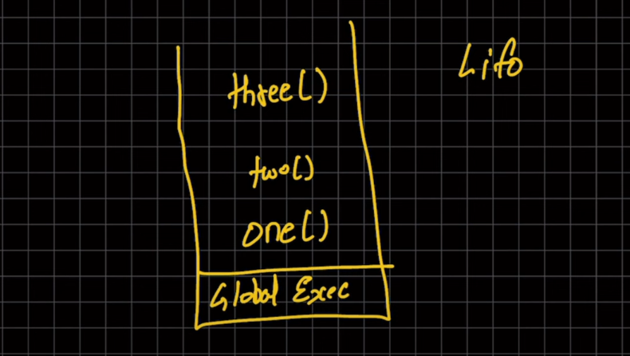

# JavaScript_Playlist
A code repo of javascript playlist

# CONST, LET & VAR  
## Var 
- Introduced in ES5 (and earlier) 
- Scope → Function-scoped (or globally-scoped if not inside a function). 
-Hoisting → Yes, but initialized as undefined until the execution reaches the declaration. 
- Re-declaration → Allowed in the same scope. 
- Re-assignment → Allowed. 

function testVar() { 
  if (true) { 
    var x = 10; // var is function-scoped 
  } 
  console.log(x); // ✅ 10 (accessible outside the block) 
} 

testVar(); 

var y = 5; 
var y = 15; // ✅ re-declaration allowed 
console.log(y); // 15 

console.log(z); // ✅ undefined (hoisted, but not initialized yet) 
var z = 20; 

## let
- Introduced in ES6 (2015)   
- Scope → Block-scoped ({ ... }).
- Hoisting → Yes, but not initialized. Accessing before declaration gives ReferenceError (this is called Temporal Dead Zone). 
- Re-declaration → ❌ Not allowed in the same scope. 
- Re-assignment → ✅ Allowed. 

1. Example:

function testLet() { 
  if (true) { 
    let a = 30; // let is block-scoped 
    console.log(a); // ✅ 30 
  } 
  // console.log(a); // ❌ ReferenceError: a is not defined 
} 

testLet(); 

let b = 40;
// let b = 50; // ❌ SyntaxError: Identifier 'b' has already been declared 
b = 60; // ✅ re-assignment is allowed 
console.log(b); // 60 

// Hoisting example 
// console.log(c); // ❌ ReferenceError (TDZ) 
let c = 70; 
console.log(c); // 70 

## Const
> Also introduced in ES6.
> Scope: Block-scoped (like let).
> Must be initialized at declaration.
> Cannot be updated or re-declared.
> Used for constants or values that should not change.ntroduced in ES6 (2015)

- Scope → Block-scoped ({ ... }). 
 
- Hoisting → Yes, but not initialized (same TDZ issue as let).
 
- Re-declaration → ❌ Not allowed in the same scope.
 
- Re-assignment → ❌ Not allowed (constant binding).
 
- ⚠️ But object/array values can still be modified (only the reference is constant).
 

1. Example
const pi = 3.14;
 
// pi = 3.14159; // ❌ TypeError: Assignment to constant variable
 
const person = { name: "Rohit", age: 22 };
 
person.age = 23; // ✅ modifying object properties is allowed
 
console.log(person); // { name: "Rohit", age: 23 }
 
// const person = {}; // ❌ Re-declaration not allowed in same scope
 
// Hoisting example
 
// console.log(d); // ❌ ReferenceError (TDZ)
 
const d = 100;
 
console.log(d); // 100

| Feature        | var               | let               | const             |
| -------------- | ----------------- | ----------------- | ----------------- |
| Scope          | Function-scoped   | Block-scoped      | Block-scoped      |
| Re-declaration | ✅ Allowed         | ❌ Not allowed     | ❌ Not allowed     |
| Update value   | ✅ Allowed         | ✅ Allowed         | ❌ Not allowed     |
| Hoisting       | ✅ Yes (undefined) | ✅ Yes (but TDZ\*) | ✅ Yes (but TDZ\*) |
| Initialization | Optional          | Optional          | Mandatory         |

**Note => prefer not to use var because of issue in  block scope and fucntional scope.

## Data type
- A data type defines the type of value a variable can hold in JavaScript.
 
- JavaScript is a dynamically typed language, meaning you don’t have to declare the type explicitly — the type is decided at runtime based on the value.
 

1. Exapmle
let x = 42;      // number
 
x = "Hello";     // now it's a string

### Categories of Data Types in JavaScript
- JavaScript has two main categories: 
- Primitive Data Types (simple, immutable values) 
- Non-Primitive (Reference) Data Types (objects, arrays, functions, etc.) 

### 1. Primitive Data Types
- Primitive values are stored directly in memory and are immutable (cannot be changed, only replaced).

#### 1. Number → integers, floats, special values (Infinity, NaN)
- Example  
let age = 25;          // integer    
let price = 99.99;     // float  
let infinity = Infinity;     
let notNumber = NaN;   // Not a Number
 

#### 2. BigInt → for very large integers beyond Number.MAX_SAFE_INTEGER
- Example  
let big = 123456789012345678901234567890n; // add "n" at end     
console.log(big + 10n); // works
 

#### 3. String → text enclosed in " ", ' ', or backticks `
- Example  
let name = "Rohit";  
let greet = `Hello, ${name}!`; // template literal
 

#### 4. Boolean → true or false
 - Example   
 let isOnline = true;  
let isAdmin = false;
 

#### 5.Undefined → variable declared but not assigned a value
- Example    
let x;   
console.log(x); // undefined
 

#### 6. Null → intentional absence of any value
- Example  
let y = null;  
console.log(y); // null
 

#### 7. Symbol → unique and immutable identifiers
- Example  
let sym1 = Symbol("id"); 
let sym2 = Symbol("id"); 
console.log(sym1 === sym2); // false (always unique)x`

### 2. Non-Primitive (Reference) Data Types
These are objects stored by reference in memory (not directly).  

#### 1.Object
- Example  
let person = { 
  name: "Rohit", 
  age: 22, 
}; 
console.log(person.name); // "Rohit" 

#### 2. Array (special kind of object)
- Example  
let colors = ["red", "green", "blue"];  
console.log(colors[0]); // "red"  

#### 3. Function (also an object in JavaScript)
- Example   
function greet() {  
  console.log("Hello World");  
}  
greet();
 

## Typeof
The typeof operator returns a string indicating the type of the operand's value  

- console.log(typeof 42); 
// Expected output: "number" 

- console.log(typeof "blubber"); 
// Expected output: "string" 

- console.log(typeof true); 
// Expected output: "boolean" 

- console.log(typeof undeclaredVariable); 
// Expected output: "undefined" 

### Type conversion 
JavaScript is loosely typed / dynamically typed, so values can be converted automatically (type coercion) or manually (type casting) into other types 

### 1. Types of Conversion
- Implicit Conversion (Type Coercion) → JS automatically converts data types. 
- Explicit Conversion (Type Casting) → We manually convert data types using functions. 

#### 1. Implicit Conversion 
JavaScript automatically converts one data type to another depending on the context. 

 - [x] Example: Number + String
let result = "5" + 2;  
console.log(result); // "52" (number converted to string) 

#### - [x] Example: String to Number (when using -, *, /)
console.log("10" - 5); // 5 (string "10" converted to number) 
console.log("10" * 2); // 20  
console.log("10" / 2); // 5  

#### - [x] Boolean to Number
console.log(true + 1);  // 2 (true → 1)  
console.log(false + 1); // 1 (false → 0)  

#### - [x] Sometimes coercion is confusing:
console.log("5" + true);  // "5true" (boolean → string)  
console.log("5" - true);  // 4 (true → 1, "5" → 5)  

### 2. Explicit Conversion (Type Casting)
We convert values manually using built-in functions.

#### - [x] Convert to Number  
Using Number(), parseInt(), parseFloat() 

console.log(Number("123"));    // 123 (string → number) 
console.log(Number("123abc")); // NaN (not a valid number) 
console.log(parseInt("123.45"));  // 123 (integer only) 
console.log(parseFloat("123.45")); // 123.45 
console.log(Number(true));  // 1 
console.log(Number(false)); // 0 
console.log(Number(null));  // 0 
console.log(Number(undefined)); // NaN 

#### - [x] Convert to String
Using String() or .toString()  

console.log(String(123));       // "123"   
console.log((123).toString());  // "123"  
console.log(String(true));      // "true"  
console.log(String(null));      // "null"  

#### - [x] Convert to Boolean
Using Boolean()  

console.log(Boolean(1));       // true   
console.log(Boolean(0));       // false 
console.log(Boolean("hello")); // true (non-empty string) 
console.log(Boolean(""));      // false (empty string) 
console.log(Boolean(null));    // false 
console.log(Boolean(undefined)); // false 
console.log(Boolean([]));      // true (empty array is truthy) 
console.log(Boolean({}));      // true (empty object is truthy) 

#### - [x] Truthy and Falsy Values
- Falsy values (convert to false in Boolean context): 
false, 0, -0, "", null, undefined, NaN 
- Everything else → truthy  
if ("hello") console.log("Truthy"); // runs  
if (0) console.log("Falsy"); // won't run  

-------------------------------------------------------------------------------------------------------------------------------------
-------------------------------------------------------------------------------------------------------------------------------------

==> Stack Memory

> Used for primitive data types (like numbers, strings, booleans, null, undefined, symbol, bigint).
> Stores function calls and execution context (where JavaScript keeps track of what’s currently running).
> Works in LIFO (Last In, First Out) order → the last thing pushed is the first to be removed.
> Fast but limited in size.

let a = 10;   // number (primitive)
let b = a;    // copy of value

b = 20;

console.log(a); // 10
console.log(b); // 20

> Here:
a is stored in the stack.
When b = a, a new copy of 10 is made in the stack.
Changing b doesn’t affect a.

==>Heap Memory
Used for non-primitive data types (like objects, arrays, functions).
Stores data in a reference-based way.
Variables in the stack only store a reference (address) to the object in the heap.
More flexible and larger than stack but slower.

Example:
let obj1 = { name: "Rohit" };
let obj2 = obj1;   // reference to the same object

obj2.name = "Maurya";

console.log(obj1.name); // "Maurya"
console.log(obj2.name); // "Maurya"

> Here:
obj1 and obj2 are stored in the stack but they both point to the same object in the heap.
Changing obj2 also affects obj1.

-------------------------------------------------------------------------------------------------------------------------------------
-------------------------------------------------------------------------------------------------------------------------------------

==> String

<!-- JS Execution Contexxt -->

> GLobal execution context
* This is the default execution context created by the JavaScript engine when a script first loads.
* It's the base context where all global code (code not inside any function) is executed.
There can only be one GEC per JavaScript file.

> Function execution context
* A new FEC is created every time a function is called.
* Each function call gets its own distinct execution context.

> Eval Execution context

==> Each execution context has two main components:
> Memory Component (Variable Environment):
* This component stores variables and function declarations as key-value pairs.
* During the creation phase of an execution context, memory is allocated for these variables (initialized to undefined) and functions (stored in their entirety).

> Code Component (Thread of Execution):
* This component is responsible for executing the JavaScript code line by line.
* JavaScript is single-threaded, meaning it processes one command at a time in a specific order within this component. 

----------------------------------------------------------------------------------------------------------------------------------------------

> Async Code
=>jS
    > Synchronoud
    > Sing le threaded
note : Above all Async and single threaded are deafult

> Execution context 
= The execute one line of code at a time
    > console log -1
    > console log -2
    call stack      memory heap

note : Each operation waits for the last one to complete executing

> Blocking code Vs Non Blocking code
=> Blocking code :
* Block the flow of program 
* Read file Sync

=> Non Blocking code :
* Does not block Exection 
* Read file Async

    
     

